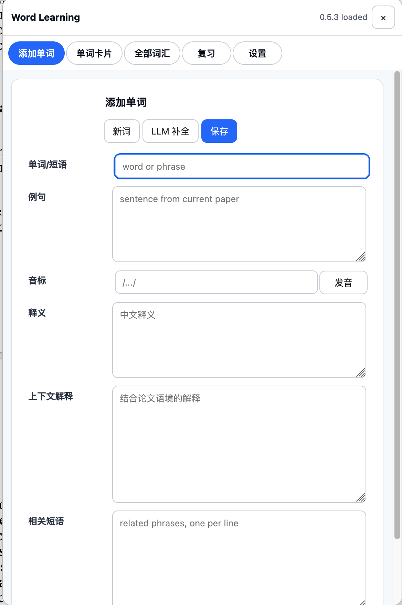
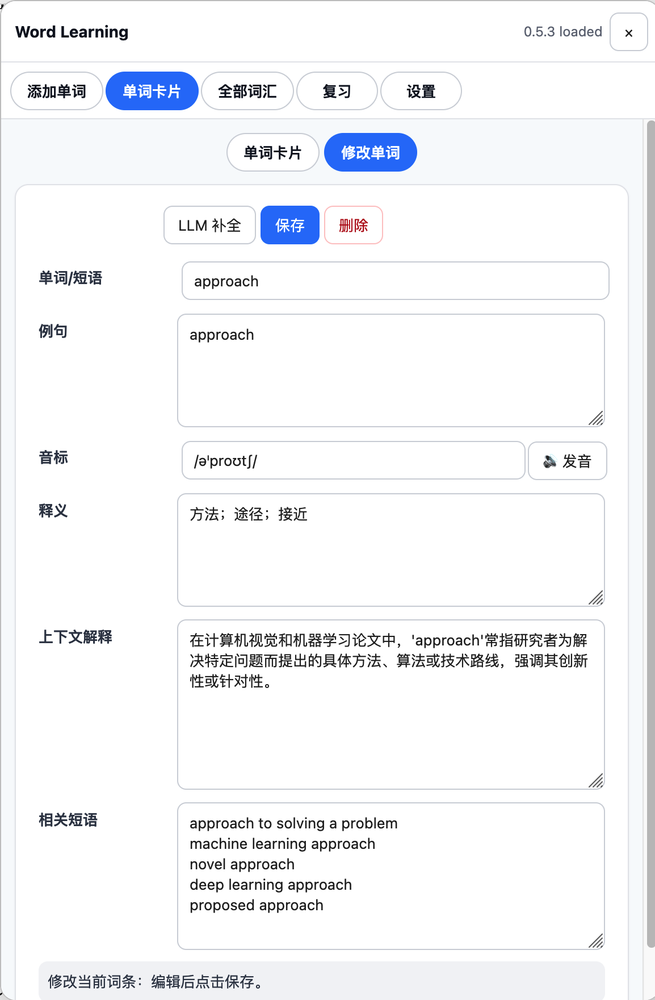
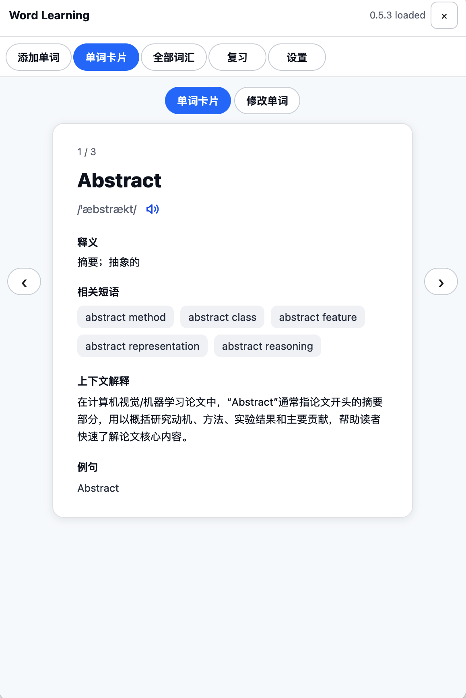
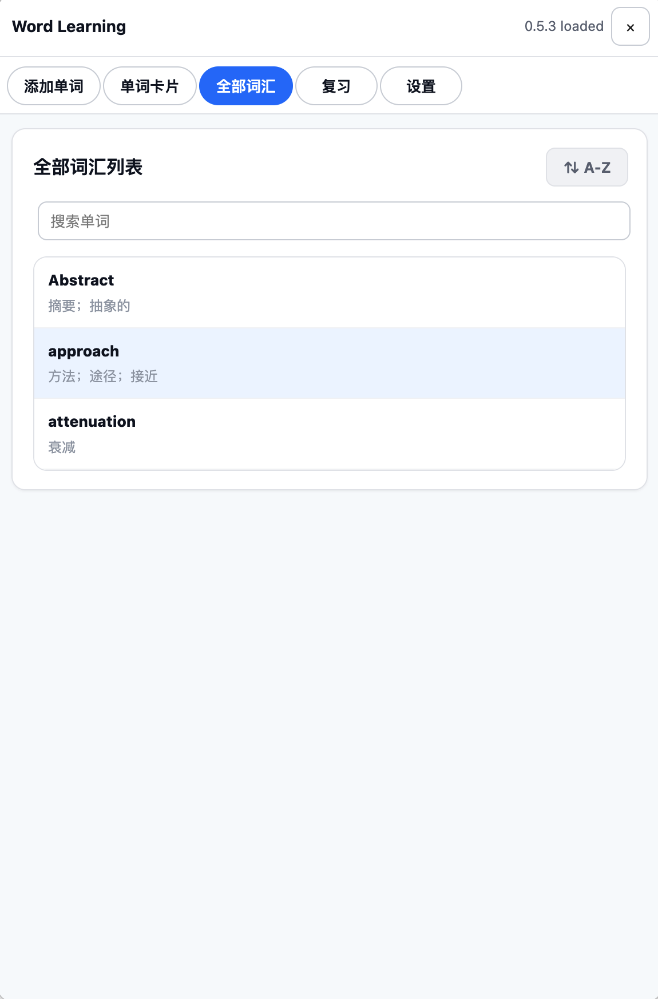
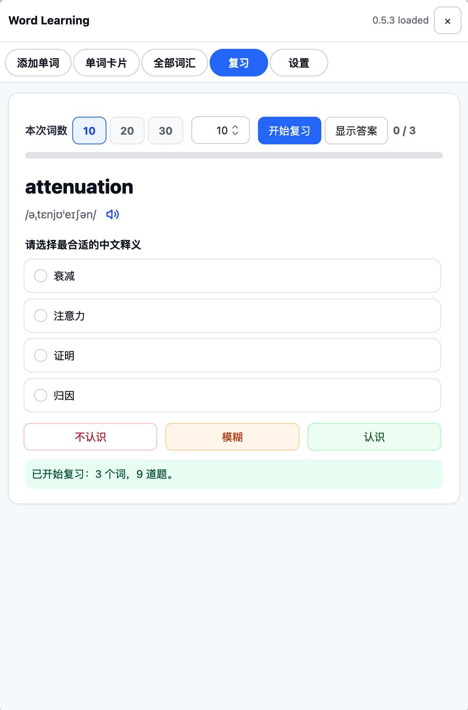
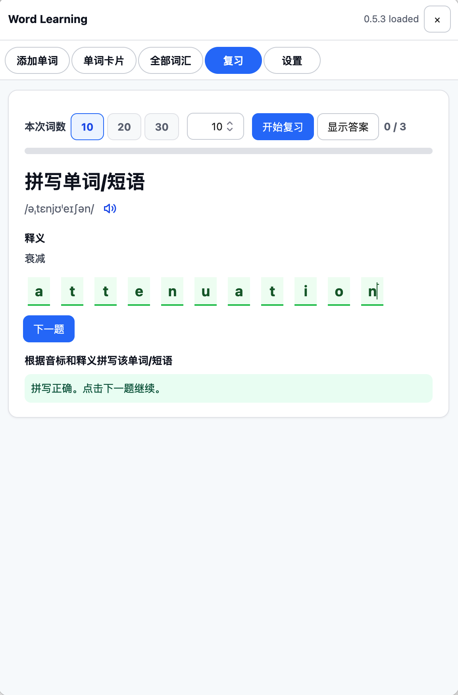
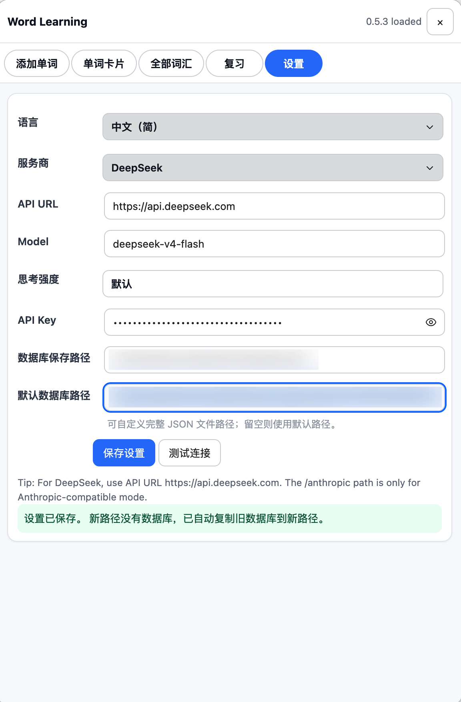

# Zotero Word Learning

This Zotero plugin and its documentation were completed with ChatGPT and Codex.

Zotero Word Learning is a Zotero 9 plugin for collecting, completing, managing, and reviewing academic English words and phrases while reading papers. It is designed for paper-reading workflows in computer vision, machine learning, artificial intelligence, and adjacent research fields.

Chinese documentation: [README.zh-CN.md](README.zh-CN.md)

## What It Does

When you read a PDF in Zotero, you can collect unfamiliar words and phrases, save them to a local wordbook, use an LLM to complete vocabulary-card fields, and review the saved terms later.

The plugin focuses on a practical reading loop:

1. Read a paper in Zotero.
2. Select an unfamiliar word or phrase.
3. Add it to Word Learning.
4. Fill or generate pronunciation, Chinese meaning, context explanation, and related phrases.
5. Save it to a local JSON wordbook.
6. Review it with cards, searchable lists, multiple-choice questions, example-context questions, and spelling practice.

## Target Environment

- Recommended runtime: Zotero 9.
- Plugin type: Zotero bootstrap plugin.
- Data storage: local JSON file in the Zotero profile by default.
- LLM use: optional, configured by the user in the plugin settings.

## Screenshots

### Add Word

Add a new term manually or from the Zotero reading workflow, then fill fields by hand or with LLM completion.



### Word Card

Browse saved terms as cards with pronunciation, meaning, related phrases, context explanation, examples, and local pronunciation playback.



### Edit Word

Edit a saved term, rerun LLM completion, save updates, or delete the entry.



### All Words

Search the full wordbook, sort terms, and jump from a list item back to the card view.



### Review: Meaning Choice

Practice active recall with multiple-choice Chinese meaning questions and mistake-weighted review actions.



### Review: Spelling

Spell the word or phrase from pronunciation and meaning, with per-letter feedback and a next-question flow.



### Settings

Configure language, LLM provider, API URL, model, thinking intensity, API key, and database path.



## Main Features

- Add words and phrases from Zotero's PDF reading workflow.
- Floating `WL` button in the Zotero main window.
- `Tools` menu entry for opening the Word Learning panel.
- Five main views: Add Word, Word Card, All Words, Review, and Settings.
- LLM completion for pronunciation, Chinese meaning, paper-context explanation, and related phrases.
- Multi-provider LLM settings for OpenAI, DeepSeek, Gemini, Anthropic, MiniMax, GLM, Grok, Qwen, Kimi, and custom OpenAI-compatible APIs.
- Thinking intensity controls for models that support reasoning or thinking parameters.
- Local JSON vocabulary database.
- Custom database path support.
- Automatic database copy when changing to an empty custom path.
- Card-based browsing and editing.
- Full vocabulary list with search and A-Z/Z-A sorting.
- Local system pronunciation through speech synthesis.
- Review sessions with meaning choice, example-based meaning choice, and spelling questions.
- Mistake-weighted review sampling.
- LLM-generated spelling/sound-alike distractors for better review questions.
- Chinese and English plugin UI.

## Repository Structure

```text
.
├── README.md
├── README.zh-CN.md
├── LICENSE
├── CHANGELOG.md
├── RELEASE_NOTES_v0.5.3.md
├── package.json
├── manifest.json
├── bootstrap.js
├── prefs.js
├── docs/
│   ├── usage.md
│   ├── llm-settings.md
│   ├── review-system.md
│   └── images/
├── scripts/
│   └── build-xpi.sh
└── dist/
    ├── zotero-word-learning-0.5.3.xpi
    └── Word Learning 0.5.3 source.zip
```

## Installation

1. Download `zotero-word-learning-0.5.3.xpi` from the release page or from the `dist/` directory.
2. Open Zotero 9.
3. Go to `Tools` -> `Add-ons`.
4. Click the gear icon in the Add-ons Manager.
5. Choose `Install Add-on From File...`.
6. Select `zotero-word-learning-0.5.3.xpi`.
7. Restart Zotero.
8. After restart, open Word Learning from the floating `WL` button or from `Tools` -> `Word Learning`.

## First-Time Setup

### 1. Open the Panel

After installation and restart, use either entry point:

- Click the floating `WL` button on the right side of the Zotero main window.
- Open `Tools` -> `Word Learning`.

The panel contains five tabs:

- `Add Word`
- `Word Card`
- `All Words`
- `Review`
- `Settings`

### 2. Set the UI Language

1. Open `Settings`.
2. Choose the UI language.
3. Click `Save Settings`.

The panel rebuilds after saving so static labels can refresh.

### 3. Configure an LLM Provider

LLM configuration is optional. Without an API key, you can still add, edit, save, browse, and review manually. LLM features require provider settings.

In `Settings`, configure:

- Provider
- API URL
- Model
- API Key
- Thinking intensity, if supported by the selected model

Then click `Test connection`. The plugin sends a small request and shows the HTTP result in the settings status area.

### 4. Choose a Database Path

By default, the wordbook is stored in the Zotero profile directory under a `word-learning` folder.

You can also enter a custom full JSON file path in `Settings`. If you change to a new path and the new file does not exist, the plugin tries to copy the old database to the new path.

## LLM Provider Notes

The provider selector includes:

- OpenAI
- DeepSeek
- Gemini
- Anthropic
- MiniMax
- GLM
- Grok
- Qwen
- Kimi
- Custom OpenAI-compatible

For OpenAI-compatible providers, enter the base API URL or a complete chat-completions endpoint. For Gemini and Anthropic, the plugin builds the corresponding provider-specific request shape.

The `Thinking intensity` setting can be:

- Default
- Low
- Medium
- High

The control is enabled only when the provider and model appear to support reasoning or thinking parameters. If the model is not detected as reasoning-capable, the control remains disabled and the plugin uses the default behavior.

## Adding Words

### From a Paper

1. Open a PDF in Zotero.
2. Select an English word or phrase.
3. Open Word Learning.
4. Go to `Add Word`.
5. Confirm that the selected text is filled in.
6. Add the example sentence from the paper.
7. Click `LLM Complete`, or fill the fields manually.
8. Review the generated content.
9. Click `Save`.

### Manually

1. Open `Add Word`.
2. Enter a word or phrase.
3. Add an example sentence if available.
4. Fill or generate pronunciation, meaning, context explanation, and related phrases.
5. Click `Save`.

After saving, the Add Word form clears so you can continue adding terms.

## Vocabulary Card Fields

Each term can contain:

- Word or phrase
- Example sentence
- Pronunciation
- Chinese meaning
- Context explanation
- Related phrases
- Review distractors
- Review statistics

The LLM completion prompt is tuned for academic paper reading. It asks for Chinese explanations that fit a computer vision or machine learning context rather than generic dictionary definitions.

## Word Card View

The `Word Card` tab is for focused browsing and editing.

It shows:

- Word or phrase
- Pronunciation
- Speak button
- Chinese meaning
- Related phrases
- Context explanation
- Example sentences

Use the navigation controls to move through saved cards. Use the edit controls to update the current entry, run LLM completion again, save changes, or delete the selected term.

## All Words View

The `All Words` tab is for fast lookup.

It supports:

- Search by word text, meaning, context explanation, and phrases.
- A-Z sorting.
- Z-A sorting.
- Click-to-open navigation from a list item to the corresponding word card.

## Pronunciation

The plugin uses local system speech synthesis for pronunciation. It does not call an external pronunciation API and does not consume LLM tokens.

Pronunciation is available on word cards and review screens. The plugin prefers English voices when available and falls back to a system voice if no preferred voice is found.

## Review System

The `Review` tab creates active-recall sessions from your saved vocabulary.

You can choose:

- 10 words
- 20 words
- 30 words
- A custom count

For each selected word, the plugin can create three task types:

1. Choose the correct Chinese meaning from the word or phrase.
2. Choose the correct Chinese meaning from the word plus an example sentence.
3. Spell the word or phrase from pronunciation and meaning.

Tasks are mixed into one randomized session.

## Review Progress

Review progress is word-based, not question-based.

For example, if you review 10 words and each word has 3 task types, the session may contain 30 internal tasks. A word is counted as completed only after its required task types are completed.

## Mistake Weighting

When a word is answered incorrectly or marked as difficult, it receives higher weight in future review sampling. This makes weak terms appear more often in later sessions.

The review buttons are:

- `Unknown`: you did not know it.
- `Blurred`: you were unsure.
- `Known`: you knew it.

Use these honestly so the review pool reflects your actual memory state.

## LLM-Generated Distractors

For multiple-choice review, the plugin can ask the configured LLM to generate spelling-alike or sound-alike distractors. These are intended to be more useful than random unrelated wrong answers.

For example, a distractor can come from a word that looks or sounds similar to the target word, while still having a different meaning.

If LLM settings are missing or the request fails, the plugin falls back to available local choices.

## Local Data

The wordbook is stored locally as JSON. The plugin writes the database through Zotero's local file APIs.

Back up the JSON file if the vocabulary database matters to you. If you use a custom database path, make sure Zotero has permission to write to that location.

## Build

The installable plugin package is an `.xpi` file. It is a ZIP archive containing:

- `manifest.json`
- `bootstrap.js`
- `prefs.js`

Build from the repository root:

```bash
npm run build
```

or:

```bash
bash scripts/build-xpi.sh
```

The output is written to `dist/`.

## Troubleshooting

### The WL button does not appear

Restart Zotero. If it still does not appear, open `Tools` -> `Add-ons`, disable and re-enable the plugin, then restart again.

### LLM Complete fails

Check the provider, API URL, model, and API key. Use `Test connection` in Settings and read the returned HTTP status.

### The database is empty after changing paths

Check whether the old database file existed and whether Zotero had permission to copy it. If needed, copy the JSON file manually.

### Pronunciation does not play

Check whether your operating system has English voices installed and whether speech synthesis is available in the Zotero runtime.

### Review choices look too generic

Configure an LLM provider and save the term again, or start a review while the API key is available. The plugin can generate stronger distractors when LLM settings are configured.

## Release

Current version: `0.5.3`

Release assets:

- `zotero-word-learning-0.5.3.xpi`
- `Word Learning 0.5.3 source.zip`

## License

MIT. See [LICENSE](LICENSE).
